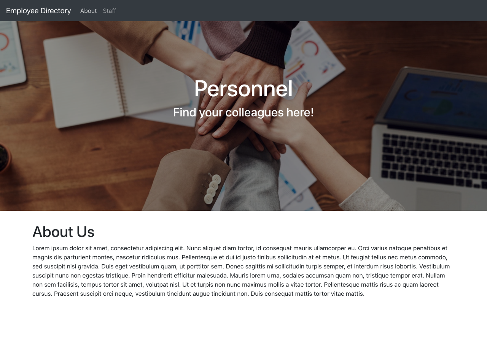
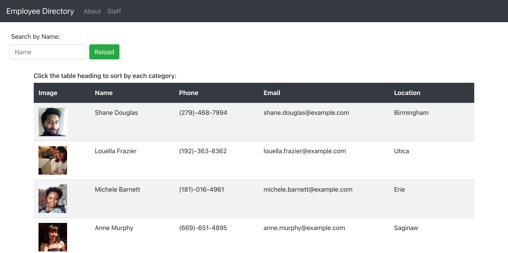

# Employee-Directory

## Task

The purpose of this assignment is to created a simple employee management system for users to be able to view entire employee directory at once so that to have the quick access to find their colleagues. This application is created with React and it has two access ways to look for employees on the list. The users either to sort employees by each information category or filter with employees's name by search. 

## Acceptance Criteria

When the user loads the page, a table of employees should render. 

The user should be able to:

  * Sort the table by at least one category

  * Filter the users by at least one property.

## Technologies Used

* React
* CSS
* Bootstrap
* Javascript
* Node.js

Below are the pages about how the application display and works:

Here is the deployed link of the application: [Employee Directory](https://personnel-directory.herokuapp.com/)

## URL Sources

Feel free to check the application repository: [https://github.com/ywen26/Employee-Directory](https://github.com/ywen26/Employee-Directory)

If you have any questions and ideas about this application, please contact me at: <yensonyu@gmail.com>

## Credits

Image sources: [https://www.pexels.com/](https://www.pexels.com/)

## License
MIT License

Copyright (c) [2021] [Ywuen Yu]

Permission is hereby granted, free of charge, to any person obtaining a copy of this software and associated documentation files (the "Software"), to deal in the Software without restriction, including without limitation the rights to use, copy, modify, merge, publish, distribute, sublicense, and/or sell copies of the Software, and to permit persons to whom the Software is furnished to do so, subject to the following conditions:

The above copyright notice and this permission notice shall be included in all copies or substantial portions of the Software.

THE SOFTWARE IS PROVIDED "AS IS", WITHOUT WARRANTY OF ANY KIND, EXPRESS OR IMPLIED, INCLUDING BUT NOT LIMITED TO THE WARRANTIES OF MERCHANTABILITY, FITNESS FOR A PARTICULAR PURPOSE AND NONINFRINGEMENT. IN NO EVENT SHALL THE AUTHORS OR COPYRIGHT HOLDERS BE LIABLE FOR ANY CLAIM, DAMAGES OR OTHER LIABILITY, WHETHER IN AN ACTION OF CONTRACT, TORT OR OTHERWISE, ARISING FROM, OUT OF OR IN CONNECTION WITH THE SOFTWARE OR THE USE OR OTHER DEALINGS IN THE SOFTWARE.